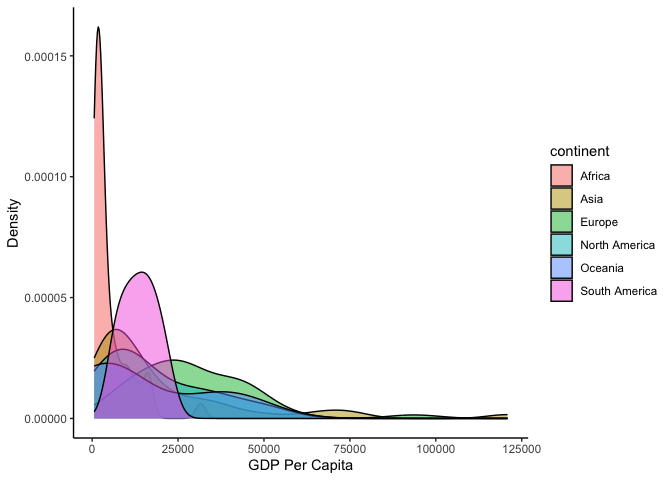

Case Study 07
================
Festus
Oct 24, 2024

``` r
library(tidyverse)
```

    ## ── Attaching core tidyverse packages ──────────────────────── tidyverse 2.0.0 ──
    ## ✔ dplyr     1.1.4     ✔ readr     2.1.5
    ## ✔ forcats   1.0.0     ✔ stringr   1.5.1
    ## ✔ ggplot2   3.5.1     ✔ tibble    3.2.1
    ## ✔ lubridate 1.9.3     ✔ tidyr     1.3.1
    ## ✔ purrr     1.0.2     
    ## ── Conflicts ────────────────────────────────────────── tidyverse_conflicts() ──
    ## ✖ dplyr::filter() masks stats::filter()
    ## ✖ dplyr::lag()    masks stats::lag()
    ## ℹ Use the conflicted package (<http://conflicted.r-lib.org/>) to force all conflicts to become errors

``` r
library(reprex)
library(sf)
```

    ## Linking to GEOS 3.11.0, GDAL 3.5.3, PROJ 9.1.0; sf_use_s2() is TRUE

``` r
library(spData)
data(world)
```

make the figure

``` r
reprex_plot <- ggplot(world, aes(x=gdpPercap, fill=continent))+
   geom_density(alpha=0.5) +
  labs(x = "GDP Per Capita", y = "Density") +
  theme_classic()

reprex_plot
```

    ## Warning: Removed 17 rows containing non-finite outside the scale range
    ## (`stat_density()`).

<!-- -->

``` r
ggsave(reprex_plot, filename= "reprexplot.png")
```

    ## Saving 7 x 5 in image

    ## Warning: Removed 17 rows containing non-finite outside the scale range
    ## (`stat_density()`).
