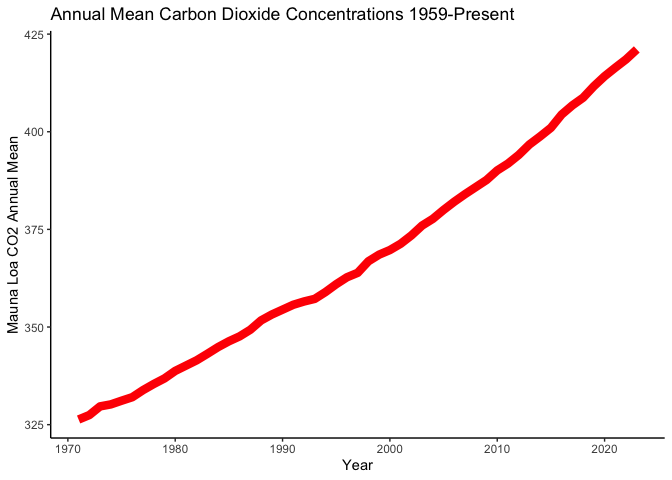
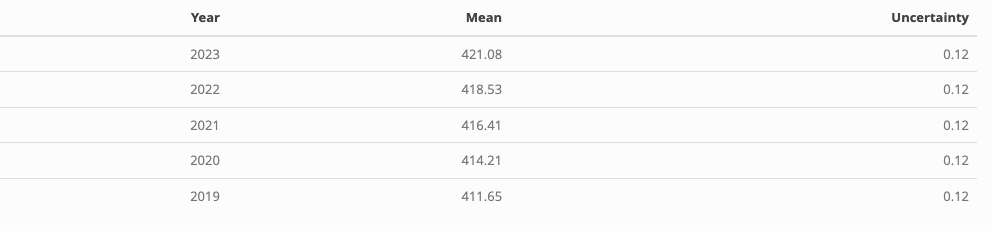

Case Study 08
================
Festus Adegbola
Oct 24, 2024

\#Load Library

``` r
library(ggplot2)
library(dplyr)
library(kableExtra)
library(webshot2)
```

\#Data The data used here is the **Mauna Loa CO2 annual mean data**. It
can be found at \[NOAA Global Monitoring Laboratory\]
(<https://gml.noaa.gov/ccgg/trends/data.html>)

\##Load Data

``` r
CO2mean <- readr::read_table("ftp://aftp.cmdl.noaa.gov/products/trends/co2/co2_annmean_mlo.txt", 
skip = 57,           
comment = "#",       
col_names = c("Year", "Mean", "Uncertainty"))
```

    ## 
    ## ── Column specification ────────────────────────────────────────────────────────
    ## cols(
    ##   Year = col_double(),
    ##   Mean = col_double(),
    ##   Uncertainty = col_double()
    ## )

\#Plot

``` r
ggplot(CO2mean, aes(Year, Mean))+
  geom_line(color="red", size=3) +
  theme_classic()+
  labs(title="Annual Mean Carbon Dioxide Concentrations 1959-Present",
      x= "Year",
      y= "Mauna Loa CO2 Annual Mean")
```

    ## Warning: Using `size` aesthetic for lines was deprecated in ggplot2 3.4.0.
    ## ℹ Please use `linewidth` instead.
    ## This warning is displayed once every 8 hours.
    ## Call `lifecycle::last_lifecycle_warnings()` to see where this warning was
    ## generated.

<!-- -->

\#Top Five Annual Mean Carbon Dioxide Concentrations at Mona Loa

``` r
CO2mean %>%
 arrange(desc(Mean)) %>%  
  slice_head(n = 5) %>%
  knitr::kable() %>%
  kable_styling(position = "center") %>%
  as_image(width = 10,file = "table.png")
```

    ## save_kable will have the best result with magick installed.

    ## Warning in as_image(., width = 10, file = "table.png"): You need to install
    ## magick in order to use width/height in as_image.



``` r
#quarto::render("path/to/file.qmd",output_format = "all")
```
